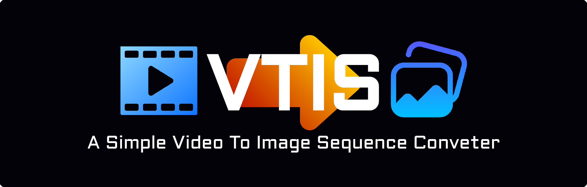
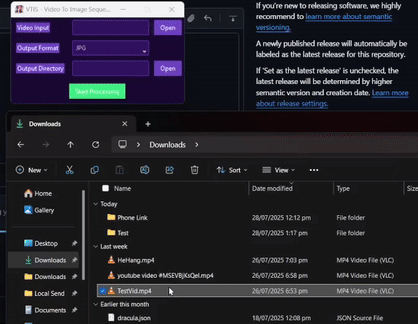

<h1 align="center">VTIS
  <sup>/ˈviː.tɪs/</sup>
</h1>
<p align="center">
  A simple lightweight tool to convert videos into an image sequence without having to tinker with <a href="https://ffmpeg.org/">ffmpeg</a> commands or opening up heavy dedicated software like premiere
</p>

## Demo

<center>



</center>

<sub>I did just have to use this software to convert the demo video into an image sequence to convert into gif using [gifski](https://gif.ski/), so there's that</sub>

## Installation

Use [pip](https://pip.pypa.io/en/stable/) to install requirements.txt

```bash
  pip install -r requirements.txt
```

Or you can download the [executable](https://github.com/TheXploler/Video-To-Image-Sequence/releases/latest)

> [!IMPORTANT]
> On **Windows**, you may see a warning message indicating that the app is from an unknown publisher. Click **More info** and then **Run anyway** to proceed.

## Run

```bash
python "VTIS.py"
```

## Contributing

All contributions are welcome!

If you face any issues or have a recommendation for a feature, don't hesitate to open a new issue, Thanks 😊

- Fandrest (TheXploler)

## License

[GNU GPLv3](https://choosealicense.com/licenses/gpl-3.0/)

## Attributions

- [Recording icons created by meaicon - Flaticon](https://www.flaticon.com/free-icons/recording)
- [Gallery icons created by SeyfDesigner - Flaticon](https://www.flaticon.com/free-icons/gallery)
- [Skip icons created by Adrly - Flaticon](https://www.flaticon.com/free-icons/skip)
